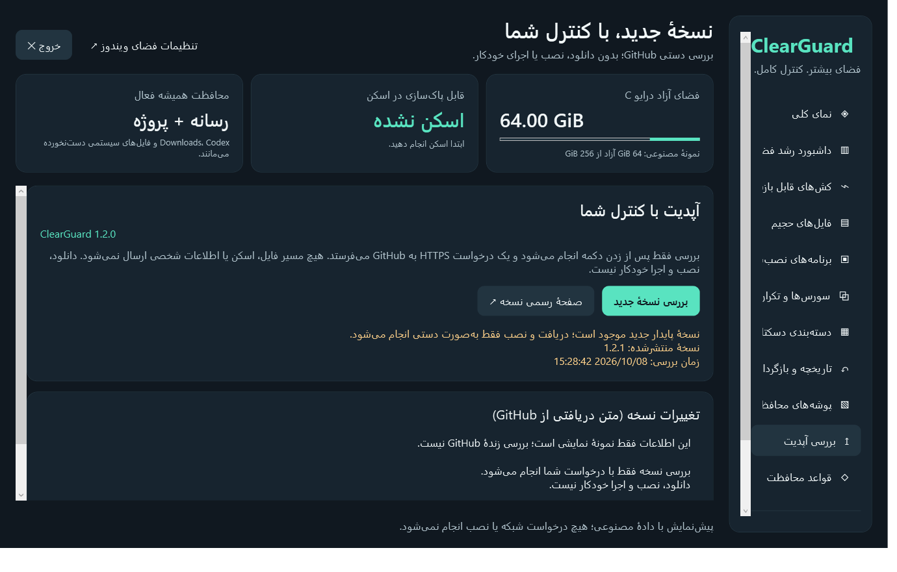
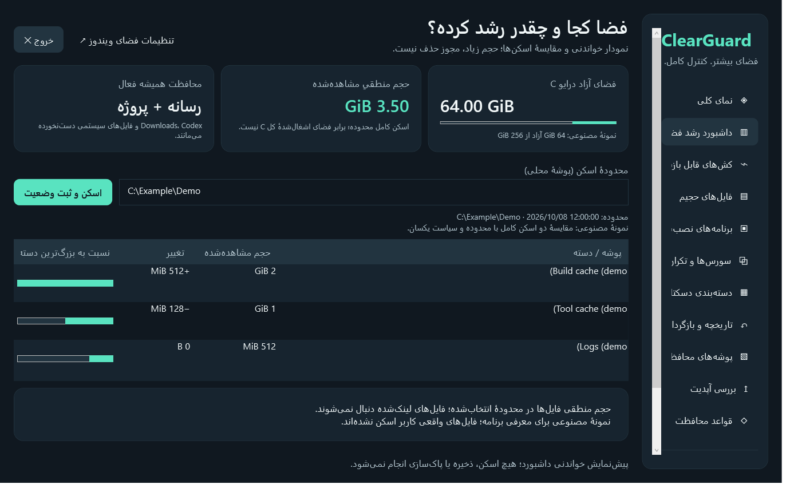
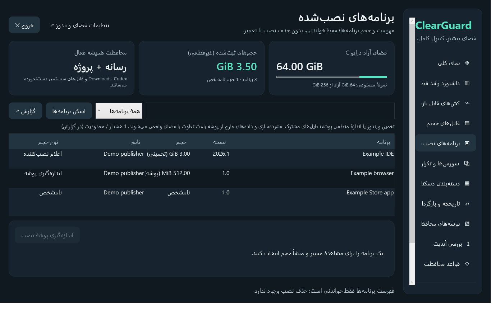

# ClearGuard — پاک‌سازی آگاهانه، حفظ فایل‌های مهم

ClearGuard یک برنامهٔ بومی و قابل‌حمل ویندوز با رابط فارسی و راست‌به‌چپ است: بررسی کش‌های قابل بازسازی، فایل‌های حجیم، سورس‌های تکراری و دسته‌بندی انتخابی دسکتاپ. ابتدا اسکن می‌کند، اثر هر اقدام را توضیح می‌دهد و بدون انتخاب و تأیید شما چیزی را حذف نمی‌کند.

[دانلود نسخهٔ ۱.۲.۰](https://github.com/matinmt3/ClearGuard/releases/tag/v1.2.0) · [English guide](README.md) · [محدودیت‌های ایمنی](SECURITY.md)

> انتقال به Recycle Bin فضای همان درایو را آزاد نمی‌کند. برنامه سطل زباله را تخلیه نمی‌کند. حذف دائمی فقط برای فایل‌های کشِ تأییدشده و با تأیید جداگانه ممکن است و قابل بازگردانی نیست.

## اجرا

۱. فایل `ClearGuard-1.2.0-Windows-Portable.zip` را از صفحهٔ انتشار بگیرید و استخراج کنید.

۲. `ClearGuard.exe` را کنار `ClearGuard.exe.config` اجرا کنید.

۳. اسکن بگیرید، مسیر و اثر هر ردیف را بخوانید و فقط مواردی را که می‌شناسید انتخاب کنید.

برای Windows 10/11 و .NET Framework 4.8 ساخته شده است. نصب، SDK، npm و دسترسی Administrator لازم ندارد. رابط برنامه فارسی است؛ مستندات فارسی و انگلیسی ارائه شده‌اند. فایل اجرایی امضای دیجیتال ندارد؛ هش فایل‌ها را با `SHA256SUMS.txt` نسخهٔ انتشار مقایسه کنید. آنتی‌ویروس یا محافظ ویندوز را غیرفعال نکنید.

## امکانات ClearGuard

| بخش | رفتار واقعی |
|---|---|
| کش‌های قابل بازسازی | اسکن و پاک‌سازی انتخابی فایل‌های شناخته‌شده؛ مسیر کامل، حجم، برنامه، اثر پاک‌سازی و علت رد شدن نمایش داده می‌شود. حذف کورکورانهٔ پوشه ندارد. |
| فایل‌های حجیم | حجم پوشه‌ها و ۱۰۰ فایل بزرگ در مسیر انتخابی، پروفایل کاربر یا درایو C؛ فقط خواندنی. |
| برنامه‌های نصب‌شده | فهرست خواندنی برنامه‌ها از نماهای ۳۲/۶۴بیتی Registry کاربر/سیستم و پرس‌وجوی Store کاربر فعلی در صورت دسترسی؛ نام، نسخه، ناشر، مسیر نصب و حجمِ تخمینی یا اندازه‌گیری‌شده با برچسب روشن. امکان Uninstall یا حذف ندارد. |
| تکراری‌های درایو | گروه‌بندی اندازه و سپس مقایسهٔ SHA-256 برای فایل‌های حداقل ۱ MiB؛ بدون امکان حذف در این بخش. |
| بررسی سورس دسکتاپ | کشف پروژه و آرشیو سورس تا هشت سطح، خواندن نسخه از manifest و مقایسهٔ کامل ساختار/هش. پوشهٔ پروژه در ۱.۲.۰ همچنان فقط گزارش می‌شود؛ تنها **ZIP سورسِ کاملاً یکسان** با نسخهٔ نگه‌داری‌شدهٔ معتبر و محافظت‌نشده می‌تواند انتخابی بازیافت شود. |
| دسته‌بندی دسکتاپ | پیش‌نمایش و انتقال انتخابی فایل مستقلِ شناخته‌شده در سطح اصلی دسکتاپ به «دسکتاپ مرتب». پوشه، پروژه، کد، APK، برنامهٔ اجرایی، آرشیو و میان‌بر جابه‌جا نمی‌شود. |
| تاریخچه و بازگردانی | رسید عملیات و Recycle Bin با بررسی هش؛ بازیابی فقط موارد همان رسید و بدون بازنویسی فایل موجود. |
| گزارش | JSON، CSV و HTML؛ مسیرها، موارد بزرگ‌تر، حجم مجاز/محافظت‌شده، نتیجهٔ عملیات و فضای آزاد C قبل/بعد. |
| فضای ذخیره‌سازی ویندوز | باز کردن تنظیمات رسمی Windows Storage؛ بدون حذف مستقیم فایل‌های Windows Update. |
| داشبورد فضا | اندازه‌گیری محدود و خواندنی پوشه‌ها، نمودار افقی حجم و مقایسهٔ snapshotهای محلی؛ بدون حذف یا انتقال. اسکن ناقص اختلاف دقیق نمی‌سازد. |
| پوشه‌های همیشه محافظت‌شده | افزودن دستی پوشهٔ محلی موجود؛ حفاظت افزوده برای کش، سورس و نسخهٔ نگه‌داری‌شده، دسته‌بندی و بازگردانی. قواعد ثابت قابل حذف نیستند. |
| بررسی نسخه | پرس‌وجوی دستی انتشار پایدار GitHub، یادداشت تغییرات به‌صورت متن ساده و باز کردن انتخابی صفحهٔ رسمی؛ بدون دریافت، نصب یا اجرای خودکار. |
| خروج | دکمهٔ مشخص «خروج» و بستن عادی پنجره؛ حین کار درخواست توقف می‌دهد و تا پایان امن Worker منتظر می‌ماند، نه بستن اجباری وسط عملیات. |

### تازه در ۱.۲.۰: بررسی دستی نسخه

شروع برنامه یا باز کردن صفحهٔ «نسخهٔ جدید» به GitHub وصل نمی‌شود. فقط با زدن دکمهٔ بررسی، اطلاعات انتشار عمومی از نشانی HTTPS ثابت `https://api.github.com/repos/matinmt3/ClearGuard/releases/latest` درخواست می‌شود. مهلت ۱۰ ثانیه است؛ احراز هویت و Cookie ندارد، تغییرمسیر دنبال نمی‌شود و شمارهٔ پایدار `vMAJOR.MINOR.PATCH`، نشانی دقیق انتشار رسمی و حجم پاسخ بررسی می‌شوند. پایان مهلت، محدودیت GitHub، پاسخ خراب یا خطای شبکه یعنی **وضعیت نامشخص**، نه «به‌روز است». یادداشت انتشار، متن ساده و محدود است؛ HTML، Markdown، لینک یا فرمان داخل آن اجرا نمی‌شود.

تنها با اقدام جداگانهٔ شما، صفحهٔ انتشارِ تأییدشده در مرورگر باز می‌شود. دریافت بسته، بررسی هش، جایگزینی فایل یا اجرای نسخهٔ جدید دستی است؛ ClearGuard آن را خودکار انجام نمی‌دهد. مرجع رسمی: [API آخرین انتشار GitHub](https://docs.github.com/en/rest/releases/releases#get-the-latest-release) و [محدودیت درخواست API](https://docs.github.com/en/rest/using-the-rest-api/rate-limits-for-the-rest-api).



اطلاعات این تصویر مصنوعی است؛ بررسی زندهٔ GitHub یا تضمین وجود نسخهٔ جدیدتر نیست.

### تازه در ۱.۲.۰: داشبورد خواندنی فضا

یک ریشهٔ محلی انتخاب و اسکن را خودتان شروع کنید. پوشه‌های سطح اول و فایل‌های مستقیم ریشه دسته‌بندی و با نمودار افقی نمایش داده می‌شوند. اندازه، جمع طول منطقی فایل‌هاست؛ محتوای فایل باز نمی‌شود. سقف پیش‌فرض ۲۰۰٬۰۰۰ ورودی، ۶۰ ثانیهٔ پیمایش با توقف تعاونی، ۶۴ سطح و ۴٬۰۹۶ دسته است. junction، symlink و reparse point دنبال نمی‌شود. پوشهٔ snapshot خود برنامه مستثناست تا ثبت تاریخچه رشد مصنوعی نسازد.

اختلاف عددی دقیقِ حجم مشاهده‌شده فقط میان **دو اسکن کامل** با همان ریشهٔ canonical، سیاست، استثناها و محدودیت‌ها نمایش داده می‌شود. این اختلاف، فضای تخصیص‌یافتهٔ فیزیکی، کل فضای مصرفی درایو، تصویر لحظه‌ای فایل‌سیستم یا حجم قابل پاک‌سازی نیست. hardlinkها به‌ازای هر مسیر شمرده می‌شوند و فایل ممکن است حین اسکن تغییر کند. اسکن اول، تغییر محدوده، لینک ردشده، خطای دسترسی، رسیدن به سقف، تاریخچهٔ خراب یا نتیجهٔ ناقص، اختلاف را «نامشخص» نگه می‌دارد. فایل‌های snapshot قبلی حفظ می‌شوند؛ لغو یا خطای ذخیره‌سازی خط مبنای قبلی را جایگزین نمی‌کند. نتیجهٔ ناقص ممکن است جداگانه ذخیره شود، اما مدرک اختلاف قطعی نیست.

پروفایل پیش‌فرض کاربر معمولاً junctionهای سازگاری و پوشهٔ غیرقابل‌دسترسی دارد؛ نتیجهٔ ناقص طبیعی است. برای مقایسهٔ کامل، پوشهٔ کوچک‌تر و عادی بدون لینک یا محدودیت دسترسی انتخاب کنید. این صفحه دکمهٔ پاک‌سازی، اسکن خودکار یا پایش پس‌زمینه ندارد.



نام، مسیر، حجم و اختلاف‌های تصویر، دادهٔ مصنوعی است؛ اسکن خصوصی رایانهٔ کاربر نیست.

### تازه در ۱.۲.۰: پوشه‌های همیشه محافظت‌شده

در صفحهٔ حفاظت، مسیر کاملِ یک پوشهٔ محلی موجود را دستی وارد و اضافه کنید. این کار فقط تنظیمات محلی ClearGuard را می‌نویسد؛ داخل پوشه چیزی نمی‌سازد، تغییر نمی‌دهد، اسکن یا جابه‌جا نمی‌کند. مرز مسیر canonical و بدون حساسیت به بزرگی حروف است؛ پوشهٔ همسایه با پیشوند مشابه، همان پوشه نیست. پوشهٔ ناپدیدشده هنگام بارگذاری از فهرست حذف نمی‌شود؛ فرزند آیندهٔ همان مسیر هم محافظت می‌ماند.

حفاظت فقط به قواعد ثابت اضافه می‌شود. برداشتن ورودی سفارشی تأیید جداگانه می‌خواهد و هیچ قاعدهٔ ثابت را حذف نمی‌کند. هم‌پوشانی با زیرپوشهٔ محافظت‌شده، **کل** ردیف کش یا پوشهٔ سورس را مسدود می‌کند؛ مسیر محافظت‌شده نسخهٔ نگه‌داری‌شدهٔ سورس هم نمی‌شود. مبدأ/مقصد دسته‌بندی و بازگردانی نیز مسدودند. انتخاب‌های اسکن قبلی با تغییر حفاظت باطل می‌شوند و موتور تنظیمات جاری را پیش از اقدام دوباره بررسی می‌کند. ردیف محافظت‌شده حجم مجاز برای پاک‌سازی ندارد.

مسیر نسبی یا drive-relative، UNC/شبکه، device، ADS، متغیر بازنشده، wildcard، اجزای مبهم نقطه/فاصله و اجداد پیوندی یا غیرقابل‌بررسی رد می‌شوند. هر جزء دارای `~` محافظه‌کارانه رد می‌شود؛ شامل نام کوتاه 8.3 و حتی نام واقعی دارای tilde است. از مسیر بلند عادی بدون `~` استفاده کنید. تنظیمات ناشناخته، خراب، قفل‌شده، پیوندی یا فایلِ قبلاً شناخته‌شدهٔ ناپدیدشده، fail-closed است: اقدام روی فایل و تغییر تنظیمات تا ترمیم دستی پیکربندی محلی مسدود می‌شود. فایل خراب خودکار بازنویسی یا بازیابی نمی‌شود؛ بررسی خواندنی و داشبورد همچنان قابل استفاده‌اند.

### حجم برنامه‌های نصب‌شده چگونه محاسبه می‌شود؟

مقدار `EstimatedSize` در Registry برحسب KiB است و با برچسب **تخمینی** نمایش داده می‌شود؛ اندازهٔ قطعی اشغال دیسک نیست. وقتی اطلاعات حجم موجود نیست، «نامشخص» نمایش داده می‌شود، نه صفر. می‌توانید پوشهٔ نصبِ واقعی و محدودِ یک برنامه را انتخابی اندازه‌گیری کنید؛ جمع اندازهٔ منطقی فایل‌هاست، نه بلوک تخصیص‌یافتهٔ فیزیکی، و AppData/کش خارج از پوشه را شامل نمی‌شود. بررسی فقط خواندنی است، junction و symlink را دنبال نمی‌کند و دسترسی ناقص یا لغو را نتیجهٔ کامل معرفی نمی‌کند. سقف بررسی ۱۰۰٬۰۰۰ ورودی، ۲۰ ثانیه و ۶۴ سطح است؛ نتیجهٔ ناقص با هشدار، تخمین قبلی یا حالت نامشخص را حفظ می‌کند. ریشهٔ درایو، Windows، پروفایل یا پوشهٔ مشترک برنامه‌ها به‌عنوان یک برنامه اندازه‌گیری نمی‌شود.

فایل مشترک، مسیرهای هم‌پوشان، فشرده‌سازی، دادهٔ برنامه و کش در مسیر دیگر باعث می‌شود جمع این حجم‌ها «حجم دقیق همهٔ برنامه‌های سیستم» نباشد. این بخش هیچ دکمهٔ حذف یا Uninstall ندارد. خروجی JSON/CSV/HTML منشأ حجم و محدودیت اندازه‌گیری را نگه می‌دارد.

فهرست بر اساس برنامه‌های ثبت‌شده و بسته‌های Store کاربر فعلی است؛ برنامهٔ Portable ثبت‌نشده یا Store کاربران دیگر ممکن است در آن نباشد. مرجع رسمی رابط‌های اطلاعات نصب: [ثبت Windows Installer](https://learn.microsoft.com/en-us/windows/win32/msi/uninstall-registry-key)، [نماهای ۳۲/۶۴بیتی Registry](https://learn.microsoft.com/en-us/dotnet/api/microsoft.win32.registryview?view=netframework-4.8.1) و [Get-AppxPackage](https://learn.microsoft.com/en-us/powershell/module/appx/get-appxpackage?view=windowsserver2025-ps).



نام و مسیر برنامه‌های این تصویر، دادهٔ نمایشی مصنوعی است؛ فهرست خصوصی رایانهٔ کاربر نیست.

## کش‌ها؛ چه چیزی دوباره ساخته یا دانلود می‌شود؟

فقط فایل‌هایی که نوع و محتوایشان تأیید شود مجازند؛ قرار گرفتن داخل مسیر کش به معنی مجوز حذف تمام محتوا نیست.

| مورد | محدوده | نتیجهٔ پاک‌سازی |
|---|---|---|
| Gradle | `wrapper`، `daemon`، `.tmp` | توزیع wrapper ممکن است دوباره دانلود شود؛ وضعیت/لاگ daemon و فایل موقت دوباره ساخته می‌شوند. Gradle یا Java نامشخصِ فعال مانع پاک‌سازی است. |
| Android Studio | `index`، `caches`، `log`، `lint`، `tmp`، `gmaven.index`، `maven.google` | Index و Cache بازسازی و ایندکس‌های Maven ممکن است تازه‌سازی شوند. Android Studio باید کاملاً بسته باشد؛ `LocalHistory` حفظ می‌شود. |
| Updaterها | کش‌های شناخته‌شدهٔ Chatbox، Oblivion، BlueStacks، 4ebur، iGap و Namava | بستهٔ به‌روزرسانی ممکن است دوباره دانلود شود؛ برنامه Uninstall نمی‌شود. |
| Chrome | `Cache`، `Code Cache`، `GPUCache`، `Service Worker/CacheStorage` | محتوا دوباره ساخته/دانلود می‌شود. Chrome باید بسته باشد؛ رمز، کوکی، History، Bookmark و اطلاعات پروفایل هدف حذف نیستند. |
| npm، pip، node-gyp | فایل‌های کش شناخته‌شده | بسته‌ها یا Headerهای Node ممکن است دوباره دانلود شوند؛ محتوای فشردهٔ نامطمئن حفظ می‌شود. |
| Go | `go-build` و `cache/download` ماژول‌ها | Build دوباره کامپایل و بستهٔ کش‌شده دوباره دانلود می‌شود؛ کل درخت سورس ماژول‌ها پاک نمی‌شود. |
| CrashDumps | Dumpهای شناخته‌شدهٔ خرابی | امکان تحلیل خرابی قدیمی از دست می‌رود؛ فقط خرابی بعدی می‌تواند Dump جدید بسازد. |
| Direct3D | `D3DSCache` | Shader دوباره ساخته می‌شود؛ اولین اجرای بازی/برنامه ممکن است کندتر باشد. |
| Android | `.android/cache` | کش دانلود بازسازی می‌شود؛ SDK و دستگاه مجازی حفظ می‌شوند. |

Gradle `caches`، Maven `.m2/repository`، کش/tmp/runtimeهای Codex، AVD و مدل AI مرورگر فقط گزارش یا محافظت می‌شوند. منشأ artifactهای Maven به‌صورت قطعی قابل تشخیص نیست؛ نسخهٔ یک هیچ artifact محلی یا dependency نامطمئن Maven را حذف نمی‌کند.

### محدودیت پوشهٔ سورس که در ۱.۲.۰ حفظ شده است

پوشهٔ پروژه حتی با اثبات یکسان بودن کامل، دست‌نخورده می‌ماند. Windows Shell بازیافت پوشه را هنگام فعال بودن قفل‌های لازمِ جلوگیری از تغییر فایل رد می‌کند؛ این نسخه برای وادار کردن حذف، حفاظت را ضعیف نمی‌کند. ردیف قدیمی یا دست‌کاری‌شدهٔ پوشه هم رد می‌شود. پوشهٔ `src`/`app` بدون شناسهٔ مستقل پروژه فقط گزارش است تا فایل یکتای والد، تنظیمات یا رسانهٔ خارج از محدودهٔ مقایسه نادیده گرفته نشود. ZIP سورسِ تأییدشدهٔ کاملاً یکسان همچنان انتخابی بازیافت می‌شود. بازگردانی رسید معتبرِ پوشهٔ قبلی حفظ شده؛ این محدودیت دربارهٔ پاک‌سازی تازهٔ پوشهٔ سورس است.

## قواعد حفاظت

- عکس، فیلم، صوت، سورس، APK/AAB، کلید، فایل محیطی حساس و `LocalHistory` در پاک‌سازی حفظ می‌شوند. تشخیص شامل پسوندهای گسترده، امضای رسانه در دادهٔ مبهم کش و محتوای ZIPهای قابل بررسی است؛ آرشیو نامطمئن، پشتیبانی‌نشده یا بیش‌ازحد پیچیده کنار گذاشته می‌شود.
- Documents، Desktop، Downloads و پروژه‌ها هدف پاک‌سازی کش نیستند. بخش جداگانهٔ دسته‌بندی می‌تواند فایل مستقلِ شناخته‌شدهٔ انتخاب‌شده، از جمله سند یا رسانه، را **جابه‌جا** کند؛ حذف نمی‌کند. همهٔ ردیف‌های دسته‌بندی پیش‌فرض انتخاب‌نشده‌اند.
- پروژه‌های SYMEXVPN و proxyx حفاظت اضافه دارند. زمان پوشه یا شمارهٔ نسخه به‌تنهایی دلیل حذف نیست؛ نسخهٔ متفاوت، شاخهٔ مستقل یا دادهٔ منحصربه‌فرد نگه داشته می‌شود.
- AVD، snapshot، system image، SDK، NDK، build-tools، platforms، دانلودهای IDM، Visual Studio Packages، Codex sessions/runtime، برنامهٔ نصب‌شده، Windows Installer، WinSxS، Program Files، ProgramData و فایل سیستمی هدف پاک‌سازی نیستند.
- junction و symlink دنبال یا حذف نمی‌شوند. فایل ناشناخته، قفل‌شده، خطای دسترسی و فرایند نامطمئن حفظ می‌شود. برنامه‌های نصب‌شده و فرایندهای نامرتبط به‌اجبار بسته نمی‌شوند؛ فقط helper اختصاصی و خواندنیِ PowerShell برای پرس‌وجوی Store ممکن است هنگام لغو یا پایان مهلت متوقف شود، نه برنامه‌های بررسی‌شده.
- پیش از اقدام، مسیر مجاز، محتوا، SHA-256، اندازه، زمان تغییر و شرایط فرایند دوباره بررسی می‌شوند. حذف فقط روی C مجاز است.
- پیش‌فرض Recycle Bin است. حذف دائمی کش به تایپ «پاک کن» نیاز دارد؛ سورس تکراری هرگز حذف دائمی نمی‌شود.

این سیاست خطر را کاهش می‌دهد؛ تضمین تشخیص همهٔ فرمت‌ها، سیاست‌های ویندوز و شرایط هم‌زمان نیست. پیش از اقدام از دادهٔ غیرقابل‌جایگزین پشتیبان بگیرید و [SECURITY.md](SECURITY.md) را بخوانید.

## گردش کار پیشنهادی

۱. اسکن خواندنی بگیرید. وجود حجم در جدول به معنی امن بودن حذف آن نیست.

۲. جزئیات هر ردیف را ببینید و برنامهٔ مرتبط را خودتان ببندید؛ سپس دوباره اسکن کنید.

۳. فقط موارد مجاز را انتخاب و فهرست تأیید را مرور کنید.

۴. رسید عملیات را بررسی کنید؛ موارد ردشده جداگانه گزارش می‌شوند. بازگردانی فایل موجود را بازنویسی نمی‌کند.

«بایت پردازش‌شده» اندازهٔ منطقی فایل‌های موفق است، نه وعدهٔ افزایش دقیق فضای آزاد. Recycle Bin، فشرده‌سازی، تخصیص دیسک و کارهای هم‌زمان ویندوز باعث تفاوت می‌شوند. حجم واقعی آزاد C قبل/بعد جداگانه ثبت می‌شود. توقف عملیات نتیجهٔ مراحل انجام‌شده را حفظ می‌کند؛ بررسی یک فایل بزرگ ممکن است تا پایان خواندن همان فایل طول بکشد.

## داده‌ها و حریم خصوصی

گزارش و رسید در `%LOCALAPPDATA%\ClearGuard\Reports`، فایل‌های `snapshot-*.json` در `%LOCALAPPDATA%\ClearGuard\Dashboard` و فهرست حفاظت در `%LOCALAPPDATA%\ClearGuard\settings\protected-folders.json` ذخیره می‌شوند. تغییر معتبر تنظیمات با فایل موقت تازه، flush و جایگزینی atomic انجام می‌شود؛ نسخهٔ قبلی JSON به‌صورت backup یکتا در همان پوشه حفظ می‌شود. تنظیمات، backupها و snapshotها خصوصی و محلی‌اند و در انتشار قرار نمی‌گیرند. مسیرهای تنظیمات، گزارش و داشبورد خود برنامه از پاک‌سازی محافظت می‌شوند.

این داده‌ها ممکن است مسیر کامل، نام فایل، هش، اندازه و اطلاعات خرابی داشته باشند؛ قبل از اشتراک‌گذاری بازبینی و اطلاعات شخصی را حذف کنید. برنامه telemetry یا ارسال فهرست فایل‌ها ندارد. درخواست دستی نسخه فقط مسیر ثابت اطلاعات انتشار و Headerهای عادی ثابت، از جمله نسخهٔ بررسی‌کنندهٔ ClearGuard، را می‌فرستد؛ مسیر محلی، snapshot، تنظیمات حفاظت، نام کاربر، فهرست برنامه/فایل یا محتوا ارسال نمی‌شود. GitHub و واسطهٔ شبکه همچنان IP عمومی درخواست‌کننده و اطلاعات عادی اتصال را می‌بینند. باز کردن صفحهٔ انتشار تابع رفتار عادی حریم خصوصی/حساب مرورگر شماست. ClearGuard خودش وابستگی جایگزین دانلود نمی‌کند؛ برنامهٔ مرتبط بعداً دانلود/بازسازی را انجام می‌دهد.

## ساخت و آزمون

سورس C# 5 / WPF / .NET Framework 4.8 است. برای ساخت، کامپایلر .NET Framework و اسمبلی‌های WPF در مسیرهای بررسی‌شدهٔ `Build.ps1` لازم‌اند؛ برای اجرای فایل انتشار فقط Runtime مربوط لازم است. وابستگی بیرونی دانلود نمی‌شود:

```powershell
& .\Build.ps1 -Destination .\build
& .\Test.ps1
& .\Package.ps1
```

دستورها را از ریشهٔ مخزن روی درایو C اجرا کنید. `Test.ps1` دادهٔ fixture-only را داخل `work\ClearGuardTests` مخزن نگه می‌دارد، همهٔ آزمون‌های ایمنی قبلی و جدید را بررسی می‌کند، یازده صفحه را رندر می‌کند و آزمون تعامل بومی رابط را اجرا می‌کند. بعضی آزمون‌ها واقعاً **فقط دادهٔ مصنوعیِ ایجادشده برای آزمون** را حذف، بازیافت، بازیابی یا جابه‌جا می‌کنند؛ هیچ‌وقت مسیر پروژه و دادهٔ شخصی را به آزمون ندهید. آزمون تغییردهندهٔ fixture فقط روی C مجاز است؛ اسکریپت مسیر روی درایو دیگر را پیش از شروع رد می‌کند. `Package.ps1` موفق بودن تمام آزمون‌های ایمنی/تعامل بدون ردشدن و گزارشِ همان فایل اجرایی را کنترل و ZIPهای Portable/Source و هش‌ها را در پوشهٔ خروجی تازه می‌سازد؛ بستهٔ موجود را بازنویسی نمی‌کند و گزارش خام، snapshot، تنظیمات خصوصی یا فهرست فایل شخصی منتشر نمی‌کند.

گزارش [آزمون ایمنی](docs/Safety-Test-Report.json) و [آزمون رابط بومی](docs/UI-Test-Report.json) تعداد نهایی آزمون‌ها و SHA-256 همان فایل اجرایی ۱.۲.۰ را ثبت می‌کنند؛ همهٔ دروازه‌های ایمنی و رابط باید موفق باشند. پوشش قبلی پاک‌سازی/بازیابی و برنامه‌ها حفظ شده و آزمون پاسخ/انتقال بررسی نسخه، سقف و مقایسه‌پذیری داشبورد، مسیر محافظت‌شده و ردیف قدیمی، یازده صفحه و تعامل بومی افزوده شده است. آزمون خودکار بررسی نسخه با پاسخ تزریقی و بدون درخواست عمومی شبکه است؛ بررسی زندهٔ جداگانه، در صورت انجام، جدا مشخص می‌شود. این شواهد محلیِ دادهٔ مصنوعی و تعامل بومی است، نه تأیید جامع تمام برنامه‌های نصب‌شده، نسخه‌های ویندوز، سیاست ACL یا ظرفیت Recycle Bin؛ محدودیت‌های باقی‌مانده در گزارش‌ها آمده‌اند.

## ارتقا و بازگشت به نسخهٔ قبلی

اعتبارسنجی انتشار: **۱۷۱ آزمون ایمنی، ۳۷ آزمون تعامل بومی و رندر ۱۱ صفحه موفق شدند؛ صفر شکست و صفر آزمون ردشده.** هر ۷۵ آزمون ایمنی و ۲۲ آزمون تعامل نسخهٔ ۱.۱.۰ حفظ شده‌اند. آزمون پاسخ تأخیری با همگام‌سازی واقعی Dispatcher هم افزوده شده است. جایگزینی رسید فقط برای خطاهای شناخته‌شدهٔ گذرای ویندوز تلاش مجدد محدود دارد؛ هیچ روش جایگزینِ حذف‌کننده‌ای ندارد. تغییر فایل در آزمون‌ها فقط روی fixture تازه بوده و هیچ پاک‌سازی واقعی کاربر انجام نشد.

پیش از جایگزینی فایل اجرایی و config، برنامه را ببندید. گزارش، رسید، snapshot، تنظیمات و backup تنظیمات را نگه دارید؛ ارتقا نیازی به حذفشان ندارد. [انتشار ۱.۱.۰](https://github.com/matinmt3/ClearGuard/releases/tag/v1.1.0) و فایل‌هایش برای مراجعه و بازیابی باینری حفظ می‌شوند. **از نسخهٔ قدیمی برای پاک‌سازی، دسته‌بندی یا بازگردانی مسیر محافظت‌شده استفاده نکنید:** نسخهٔ ۱.۱.۰ و قبل، حفاظت سفارشی ۱.۲.۰ را نمی‌شناسد و downgrade این قواعد جدید را از دست می‌دهد. اگر قابلیت تازه مشکل داشت، اقدام تغییردهنده را متوقف و داده/رسید فعلی را برای گزارش مشکل نگه دارید. رسید را پاک و Recycle Bin را برای تغییر نسخه تخلیه نکنید.

## مجوز و مشارکت

[MIT License](LICENSE.txt). تغییر محدودهٔ حذف یا سیاست حفاظت باید همراه آزمون و توضیح روشن باشد. برای گزارش مشکل از نمونهٔ کوچک مصنوعی استفاده کنید؛ فایل شخصی یا گزارش محلیِ بدون پوشاندن اطلاعات منتشر نکنید.
