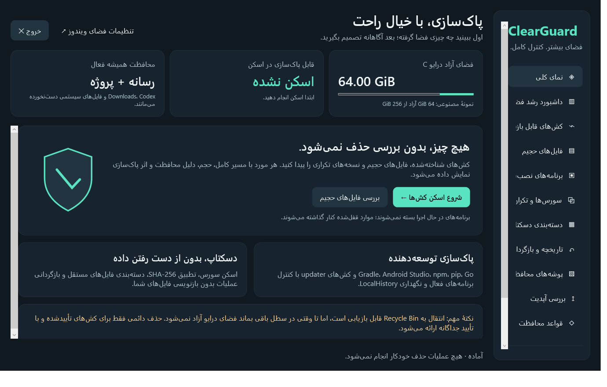

# ClearGuard

**Know what you clean. Keep what matters.**

ClearGuard is a portable Windows disk-cleanup and Desktop audit tool with a Persian, right-to-left interface. It scans first, explains each candidate, and requires an explicit choice before an operation. The cleanup engine is deliberately conservative: it works from a small cache allowlist, rechecks files before acting, and keeps unknown or protected data.

**[Download v1.2.0](https://github.com/matinmt3/ClearGuard/releases/tag/v1.2.0)** · [راهنمای فارسی](README.fa.md) · [Safety and limitations](SECURITY.md)

> ClearGuard does not automatically delete files. Moving a file to the Recycle Bin does not free space on the same drive. The app never empties the Recycle Bin. Optional permanent deletion is limited to verified cache files and cannot be undone.



## فارسی، کوتاه

ClearGuard یک برنامهٔ ویندوزی قابل‌حمل با رابط فارسی برای بررسی فضای درایو C، کش‌های قابل بازسازی، فایل‌های حجیم، سورس‌های تکراری و دسته‌بندی انتخابی دسکتاپ است. نسخهٔ ۱.۲.۰ بررسی دستی نسخهٔ GitHub، داشبورد خواندنی تغییر حجم پوشه‌ها و حفاظت شخصیِ پوشه‌ها را اضافه می‌کند. ابتدا اسکن می‌کند؛ حذف خودکار ندارد. عکس و فیلم، پروژه‌ها، فایل‌های شخصی، SDK/AVD، LocalHistory و Codex محافظت می‌شوند. راهنمای کامل در [README.fa.md](README.fa.md) است.

## Run

1. Download `ClearGuard-1.2.0-Windows-Portable.zip` from the release page.
2. Extract the ZIP. Keep `ClearGuard.exe` and `ClearGuard.exe.config` together.
3. Run `ClearGuard.exe`, scan, inspect the results, and select only the operations you understand.

Built for Windows 10/11 with .NET Framework 4.8. No installer, SDK, npm, external package downloads, or Administrator privileges are needed to run it. The interface is Persian only; this repository's documentation is bilingual. The executable is not digitally signed. Compare the release checksums; do not disable antivirus or Windows protections to run it.

## What ClearGuard does

| Area | Behavior |
|---|---|
| Rebuildable caches | Per-file cleanup of recognized eligible files, not blind folder removal. Lists full paths, size, application, cleanup effect, and skip reasons. |
| Large-file inventory | Read-only folder sizes and the 100 largest files under a selected root; can inspect the user profile or C drive. |
| Installed applications | Read-only application inventory from current-user/machine 32-/64-bit registry views and a best-effort query of current-user Store packages. Shows application name, version, publisher, installation path, and a labeled size estimate or selected-folder measurement. Never uninstalls programs. |
| Drive duplicates | Read-only size grouping followed by SHA-256 comparison for files at least 1 MiB. No deletion in this section. |
| Desktop source audit | Discovers projects/source archives up to eight levels deep. Reads manifest versions and compares complete structure and hashes. Project folders remain report-only in v1.2.0; only verified exact **source ZIP** duplicates with a verified unchanged, unprotected keeper can be selected for recycling. |
| Desktop organization | Preview plus explicit movement of recognized loose files at the Desktop root into `دسکتاپ مرتب`. Folders, projects, code, APKs, executables, archives, and shortcuts stay in place. |
| History and restore | Operation journals and verified Recycle Bin receipts; restores only items in a selected receipt, without overwriting existing files. Permanent deletion is not restorable. |
| Reports | JSON, CSV, and HTML; largest items, eligible/protected sizes, operation outcomes, logical processed bytes, and actual C-drive free space before/after. |
| Windows storage | Opens the official Windows Storage settings. Does not directly delete Windows Update files. |
| Space dashboard | Explicit bounded read-only folder measurement, horizontal size bars, and local snapshot comparisons. No delete or move action; incomplete scans never produce an exact delta. |
| Always-protected folders | Manually add existing local folders. Additive protections block cache cleanup, source candidates/keepers, organizer moves, and restore endpoints; built-in protections cannot be removed. |
| Updates | Manual stable-release check against the fixed official GitHub endpoint, plain-text release notes, and an explicitly opened official release page. No automatic download, installation, or execution. |
| Exit | A visible Exit button and normal window close. During work, Exit requests cancellation and waits for the worker to finish safely instead of terminating the process mid-operation. |

### New in v1.2.0: manual updates

Opening ClearGuard or the Updates page does not contact GitHub. Press **Check** to request public release metadata from the fixed HTTPS endpoint `https://api.github.com/repos/matinmt3/ClearGuard/releases/latest`. The check has a 10-second deadline, uses no authentication or cookies, blocks redirects, validates stable `vMAJOR.MINOR.PATCH` tags and the exact official release URL, and bounds the response size. Timeout, rate limiting, malformed data, or network failure means **unknown**, not “up to date.” Release notes are bounded plain text: embedded HTML, Markdown, links, and commands are not executed.

Only an additional explicit action opens the validated official GitHub release page in your browser. Downloading, verifying, replacing, or executing an update remains your decision; ClearGuard does none of these automatically. See GitHub's [latest-release API](https://docs.github.com/en/rest/releases/releases#get-the-latest-release) and [API rate limits](https://docs.github.com/en/rest/using-the-rest-api/rate-limits-for-the-rest-api).


This screenshot uses synthetic release data; it is not a live check or a promise that a newer release exists.

### New in v1.2.0: read-only space dashboard

Choose a local root and explicitly scan it. The dashboard groups immediate subfolders and direct root files, shows horizontal size bars, and sums logical file lengths without opening file contents. The default limits are 200,000 entries, 60 seconds of cooperative traversal, 64 directory levels, and 4,096 categories. It does not follow reparse points, junctions, or symlinks. Its own snapshot directory is excluded so saving history cannot manufacture growth.

Two **complete** snapshots of the same canonical root, traversal policy, exclusions, and limits can show exact arithmetic deltas of the observed logical bytes. These are not physical allocated blocks, total disk usage, a point-in-time filesystem snapshot, or reclaimable space. Hard links are counted per path and files can change during traversal. A first scan, different scope, skipped link, access failure, limit, malformed history, or incomplete scan leaves the delta unknown. Previous snapshot files are retained; cancellation and failed persistence do not replace the prior baseline. A partial result may be saved separately, but never becomes evidence of an exact change.

The default user profile commonly contains compatibility junctions and inaccessible folders, so a partial result is expected. Choose a smaller ordinary folder without links or access restrictions to obtain comparable complete scans. There is no cleanup button, automatic scan, or background monitoring on this page.


Names, paths, sizes, and deltas in this screenshot are synthetic demonstration data, not a scan of a user's computer.

### New in v1.2.0: always-protected folders

In the protected-folders page, manually enter an existing folder's full local path and add it. This only writes ClearGuard's local settings; it does not create, edit, scan, or move anything inside that folder. Entries use canonical, case-insensitive hierarchy boundaries, so a similarly prefixed sibling is not the same folder. Missing folders remain protected when settings are loaded, including future children at that path.

Protections are additive: removing a custom entry requires explicit confirmation and cannot remove built-in rules. An overlap with a protected descendant blocks the **entire** cache or source-folder candidate; protected paths cannot be used as source keepers. Organizer source/destination and restore endpoints are blocked too. Old selected rows are invalidated, and the engine rechecks the current settings immediately before acting. Protected rows have no eligible cleanup bytes.

Relative/drive-relative paths, UNC/network paths, devices, alternate data streams, unresolved variables, wildcards, ambiguous dot/space components, and linked or uninspectable ancestors are refused. Any component containing `~` is conservatively refused, including 8.3 aliases and legitimate tilde-bearing names; use a normal long path without `~`. Unknown, corrupt, locked, linked, or disappeared previously known settings fail closed: file operations and setting changes are blocked until you manually repair the local configuration. No malformed file is silently overwritten or recovered. Read-only inventory/dashboard work remains available.

### Understanding installed-application sizes

The registry's `EstimatedSize` is expressed in KiB and is shown as an **estimate**, not verified disk usage. Missing size information is **unknown**, not zero. You can explicitly measure a selected application's genuine leaf installation folder; measurement sums logical file lengths, not physical allocated disk blocks, and excludes external AppData/caches. It is read-only, does not follow reparse points, and reports incomplete access or cancellation rather than pretending the result is complete. Measurement is bounded to 100,000 entries, 20 seconds, and 64 directory levels; an incomplete result retains the prior estimate or unknown state with a warning. Broad Windows, drive, profile, and shared program roots are not recursively measured as a single application.

Shared components, overlapping folders, compression, package data, and caches elsewhere make these figures unsuitable for an exact system-wide total. Installed size is not a cleanup candidate, and this section has no delete or uninstall action. JSON/CSV/HTML exports preserve the size source and limitations.

Inventory is based on registered applications and Store packages for the current user; unregistered portable programs and other users' Store apps may not appear. The metadata interfaces are documented by Microsoft: [Windows Installer uninstall registration](https://learn.microsoft.com/en-us/windows/win32/msi/uninstall-registry-key), [32-/64-bit RegistryView](https://learn.microsoft.com/en-us/dotnet/api/microsoft.win32.registryview?view=netframework-4.8.1), and [Get-AppxPackage](https://learn.microsoft.com/en-us/powershell/module/appx/get-appxpackage?view=windowsserver2025-ps).


The application names and paths in this screenshot are synthetic demonstration data, not an inventory of a user's computer.

### Cache scope and cost of rebuilding

Only recognized files that pass the protection checks are eligible; not every file inside these locations will be removed.

| Cache family | Eligible scope | What happens afterward |
|---|---|---|
| Gradle | `wrapper`, `daemon`, `.tmp` | Wrapper distributions may download again; daemon state/logs and temporary files are recreated. Active Gradle/Java uncertainty blocks cleanup. |
| Android Studio | `index`, `caches`, `log`, `lint`, `tmp`, `gmaven.index`, `maven.google` | Indexes and caches rebuild; Maven indexes may refresh. Android Studio must be fully closed. `LocalHistory` stays untouched. |
| Updaters | Recognized cache locations for Chatbox, Oblivion, BlueStacks, 4ebur, iGap, Namava | Update packages may download again. Installed apps are not uninstalled. |
| Chrome | `Cache`, `Code Cache`, `GPUCache`, `Service Worker/CacheStorage` in recognized profiles | Cached content rebuilds/downloads again. Chrome must be closed. Passwords, cookies, history, bookmarks, and profile data are not cleanup targets. |
| npm, pip, node-gyp | Recognized cache files | Packages or Node headers may download again; unsupported/uncertain compressed content stays. |
| Go | `go-build`, module `cache/download` | Build artifacts recompile; cached module downloads may download again. The broader module source tree is not a cleanup target. |
| CrashDumps | Recognized crash dump files | Old crash-debugging evidence is lost. Dumps are not rebuilt unless a future crash occurs. |
| Direct3D | `D3DSCache` | Shaders rebuild; an initial application/game launch can be slower. |
| Android download cache | `.android/cache` | Cached downloads are recreated. SDK components and virtual devices remain. |

**Report-only / protected:** Gradle `caches`, Maven `.m2/repository`, Codex cache/tmp/runtime, Android AVD, and Chrome's on-device AI model. Local Maven artifacts cannot reliably be separated from downloadable dependencies, so v1 does not delete Maven artifacts.

### Source-folder limitation retained in v1.2.0

Source project folders remain in place, even when a complete comparison proves they are duplicates. Windows Shell refuses folder recycling while the required file write-denial holds are active; this release does not weaken those protections to force deletion. Stale or forged eligible folder rows are also refused. Markerless `src`/`app` children without an independent project boundary are report-only, so unique parent assets or settings are not mistaken for part of an identical project. Eligible verified source ZIP duplicates can still be explicitly recycled. Recovery of existing verified folder receipts remains supported; the restriction concerns new source-folder cleanup.

## Safety boundaries

- Photos, videos, audio, source code, APK/AAB, keys, sensitive environment files, and Android Studio `LocalHistory` are protected from cleanup. Content checks include extensions, recognized media signatures inside opaque cache data, and supported ZIP contents. Unsupported, ambiguous, or overly complex archives are kept.
- Desktop, Documents, Downloads, and projects are not cache-cleanup targets. The separate organizer can move explicitly selected recognized loose documents/media; it never deletes them. All organizer rows start unselected.
- SYMEXVPN and proxyx project identities receive additional source-audit protection. Different branches, changed copies, or unique data are kept. A newer timestamp or version number alone is never a deletion rule.
- AVDs, emulator snapshots, SDK system images, SDK/NDK/build-tools/platforms, IDM downloads, Visual Studio packages, Codex sessions/runtimes, installed programs, Windows Installer, WinSxS, Program Files, ProgramData, and system files are not cleanup targets.
- Reparse points, symlinks, and junctions are not followed or removed. Unknown files, locked files, permission failures, and uncertain process checks are skipped.
- Approved paths, content, hashes, sizes, modification times, and process conditions are checked again before action. Deletion is restricted to C. Installed applications and unrelated processes are never forcibly terminated. A Store metadata query may stop its own private, read-only PowerShell helper on cancellation or timeout; it does not close the scanned applications.
- Recycle Bin is the default. Permanent cache deletion requires typing the Persian confirmation `پاک کن`. Source duplicates cannot use permanent deletion.

The safety policy reduces risk; it is not a guarantee that every possible file format, OS policy, or race is detectable. Back up irreplaceable data and read [SECURITY.md](SECURITY.md) before using destructive modes.

## Local data and privacy

Reports and operation receipts are stored under `%LOCALAPPDATA%\ClearGuard\Reports`. Dashboard snapshots are local `snapshot-*.json` files under `%LOCALAPPDATA%\ClearGuard\Dashboard`. Custom protections are stored in `%LOCALAPPDATA%\ClearGuard\settings\protected-folders.json`; validated edits use a flushed new temporary file and atomic replacement with unique previous-JSON backups in that same settings directory. Settings, backups, and snapshots are private local data, not release assets. ClearGuard's own settings/reports/dashboard locations are protected from cleanup.

These files may contain full filenames, local paths, hashes, sizes, and crash metadata. Do not publish them without reviewing/redacting them. ClearGuard has no telemetry or file-inventory upload feature. The manual update request sends only the fixed release-metadata request and ordinary static HTTP headers, including the ClearGuard checker version—not local paths, snapshots, protection settings, usernames, inventories, or file contents. GitHub and network intermediaries can still see the requesting public IP and normal connection metadata. Opening the release page uses your browser's normal privacy/account behavior. ClearGuard does not itself download replacement dependencies; the relevant application does that when needed.

## Build and validate

The source uses C# 5, WPF, and .NET Framework 4.8. Building requires the .NET Framework compiler and WPF assemblies at the paths checked by `Build.ps1`; the runtime alone is the requirement for running the published app. No external package downloads are needed. `Build.ps1` invokes the installed compiler and copies the application configuration:

```powershell
& .\Build.ps1 -Destination .\build
```

Run from the repository root on the C drive. `Test.ps1` keeps fixture-only safety tests inside the repository's `work\ClearGuardTests` tree, verifies all legacy and added safety regressions, renders all eleven native pages, and runs native UI interaction checks:

```powershell
& .\Test.ps1
& .\Package.ps1
```

Tests create isolated synthetic files. Some tests genuinely recycle, restore, move, or permanently delete **those generated fixtures only**. Never point a test at your projects or personal data. Fixture mutation is intentionally restricted to C; `Test.ps1` rejects another drive before starting. `Package.ps1` requires all safety and interaction checks to pass with no skips and reports for the exact binary, creates portable/source ZIPs with checksums in a fresh output directory, and refuses to overwrite existing package directories. It packages sanitized public test reports, not raw local reports or inventories. `--ui-smoke <output-directory>` exercises all pages and the fixture-backed UI harness; it is still not a substitute for manual testing of every Windows policy or live application state.

The exact v1.2.0 binary must pass all safety/UI gates recorded in the published [safety report](docs/Safety-Test-Report.json) and [native UI report](docs/UI-Test-Report.json), which record the final counts and executable SHA-256. Coverage retains the original cleanup/recovery and installed-application cases and adds updater transport/parser behavior, dashboard bounds/comparability, protected-path/stale-row regressions, all eleven pages, and native interaction checks. Automated updater tests use injected responses without public network requests; any separate live check is identified as such. This is local fixture/native interaction evidence, not exhaustive certification of every installed application, Windows version, ACL policy, or Recycle Bin capacity behavior. Read the reports' remaining gaps.

### Source layout

Release validation: **171 safety tests, 36 native UI interaction checks, and 11 page renders passed; zero failures or skips.** All 75 v1.1.0 safety cases and 22 interaction checks remain covered. Journal replacement now retries only bounded, recognized Windows sharing/replacement failures without a destructive fallback. Tests changed only freshly generated fixtures; no real user cleanup was performed.

- `App.cs`, `MainWindow.xaml`: native UI and user confirmations.
- `CacheEngine.cs`, `SafetyPolicy.cs`: candidate allowlist, inspection, and revalidation.
- `DesktopTools.cs`: source comparison, read-only duplicates, organization, and restore.
- `InstalledApps.cs`: read-only installed-application discovery, size provenance, and selected-folder measurement.
- `UpdateChecker.cs`: fixed-endpoint manual release lookup and inert metadata validation.
- `SpaceDashboard.cs`: bounded read-only logical-folder measurement and local snapshot comparison.
- `ProtectedFolders.cs`: strict additive protected paths and fail-closed local persistence.
- `RecycleService.cs`: Windows shell recycling and receipt verification.
- `Models.cs`, `ReportExport.cs`: local reports and safe exports.
- `SafetyTests.cs`: isolated safety and recovery fixtures.
- `InstalledAppsTests.cs`, `UpdateCheckerTests.cs`, `SpaceDashboardTests.cs`, `ProtectedFoldersTests.cs`, `QaHarness.cs`: feature regressions and native fixture-backed UI interaction tests.

## Upgrade and rollback

Close ClearGuard before replacing its portable executable/configuration. Keep local reports, receipts, snapshots, settings, and settings backups; upgrading does not require deleting them. The [v1.1.0 release](https://github.com/matinmt3/ClearGuard/releases/tag/v1.1.0) and its assets remain preserved for reference and binary recovery. **Do not use an older release to clean, organize, or restore protected paths:** v1.1.0 and earlier do not know v1.2.0 custom protections, and downgrading loses those new enforcement rules. If a new feature misbehaves, stop mutating operations and keep your current data/receipts while reporting the issue. Do not remove receipts or empty the Recycle Bin to change versions.

## Contributions and license

MIT License — see [LICENSE.txt](LICENSE.txt). Safety-sensitive changes need fixture tests and a clear explanation of the protection boundaries. Do not broaden deletion targets or weaken fail-closed behavior without explicit review. Report issues with a small synthetic reproduction, not personal files or unredacted local inventories.
